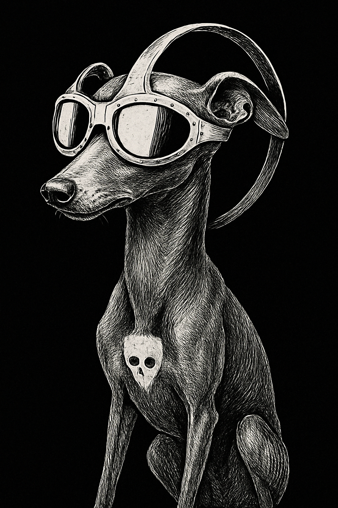

<h1 align="center">Moriarty Sese-Seko</h1>
<p align="center"><em> Going as fast as you can see</em></p>

<p align="center">
  
</p>

## Overview

Moriarty is a comprehensive framework for analyzing sports videos using computer vision, distributed computing, and artificial intelligence. The system extracts and analyzes biomechanical data from videos to provide coaches, athletes, and researchers with actionable insights about performance and technique.

### Core Goals

1. **Accurate Pose Analysis**: Extract precise pose data from sports videos, optimized for athletic movements
2. **Distributed Processing**: Scale efficiently from personal computers to high-performance clusters
3. **AI-Powered Insights**: Apply language models to biomechanical data for human-interpretable analysis 
4. **Extendable Architecture**: Support multiple sports and analysis techniques through a modular design

## System Architecture

Moriarty is designed as a modular pipeline with four main analysis components:

1. **Pose Analysis**: Human detection, pose estimation, and skeleton visualization
2. **Dynamics Analysis**: Kinematics, stride patterns, synchronization, and ground reaction forces
3. **Motion Analysis**: Movement classification, tracking, and stabilography
4. **Scene Analysis**: Video processing, scene detection, and metrics calculation

These components are integrated through the `CoreIntegrator` and orchestrated by the `MoriartyPipeline` to provide a seamless analysis workflow:

```
Video Input → Pose Detection → Biomechanical Analysis → LLM Interpretation → Reports/Visualizations
```

## Technical Components

### Core Module Integration

The `CoreIntegrator` class serves as the unified interface for all analysis modules, managing their initialization, execution, and result collection:

```python
# Core modules are organized by function
from src.core.pose import PoseDetector, HumanDetector, SkeletonDrawer
from src.core.dynamics import KinematicsAnalyzer, StrideAnalyzer, GRFAnalyzer
from src.core.motion import MotionClassifier, MovementTracker
from src.core.scene import SceneDetector, VideoManager
```

### Pipeline Orchestration

The `MoriartyPipeline` orchestrates the complete workflow, with two main pipelines:

1. **Sprint Running Video Analysis Pipeline**: Processes videos to extract biomechanical data
2. **Domain Expert LLM Training Pipeline**: Trains language models on biomechanical data

```python
# Run video analysis
result = pipeline.run_sprint_video_analysis(
    video_path="videos/sprint.mp4",
    create_visualizations=True,
    generate_report=True
)

# Train LLM on analysis data
pipeline.setup_llm_training(base_model="facebook/opt-1.3b")
pipeline.start_llm_training(background=True)
```

### Distributed Processing

Moriarty uses a combination of multiprocessing and resource management to efficiently process videos:

- **Memory Monitoring**: Prevents system crashes by dynamically adjusting workload
- **Adaptive Worker Allocation**: Scales based on available CPU cores
- **Batch Processing**: Handles multiple videos efficiently

### GPU Acceleration

Moriarty now features comprehensive GPU acceleration across multiple components:

- **Multi-Component GPU Support**: Extends beyond pose detection to dynamics analysis, GRF estimation, and AI components
- **Tensor-Based Parallelism**: Uses PyTorch tensors for efficient batch processing on GPU
- **Automatic Fallback**: Gracefully falls back to CPU when GPU is unavailable
- **Dynamic Resource Management**: Automatically clears GPU memory between processing stages

```python
# Initialize with GPU acceleration
analyzer = DynamicsAnalyzer(use_gpu=True)

# Biomechanical analysis with GPU acceleration
results = analyzer.calculate_dynamics_batch(positions, velocities, accelerations)
```

## Technical Implementation Details

### Pose Analysis Module

The pose analysis module implements several key algorithms:

- **Human Detection**: Uses YOLOv8 for person detection with confidence thresholds optimized for athletic movements
- **Pose Estimation**: Implements MediaPipe's BlazePose model (33-point skeleton) with custom adaptations for sports movements
- **Skeleton Tracking**: Uses DeepSORT with Kalman filtering for maintaining identity across frames
- **Skeleton Drawing**: Custom OpenCV drawing with joint confidence visualization and color-coded movement paths

Model specifications:
- MediaPipe pose complexity: Levels 0 (fast), 1 (balanced), 2 (accurate)
- YOLOv8 with IOU threshold of 0.45 and confidence threshold of 0.6 for athlete detection
- Custom pose model available for fine-tuning on sports-specific data

### Dynamics Analysis Module

The dynamics module implements biomechanical analysis algorithms:

- **Kinematics Analyzer**: Uses numerical differentiation (central difference method) with Savitzky-Golay filtering to compute velocities and accelerations from joint positions
- **Stride Analyzer**: Implements a contact detection algorithm based on ankle velocity and acceleration patterns with zero-crossing detection
- **Synchronization Analyzer**: Cross-correlation analysis between joint movements, with Dynamic Time Warping (DTW) for temporal alignment
- **GRF Analyzer**: Implements a modified spring-mass model for ground reaction force estimation with body segment parameters derived from anthropometric tables
- **AI Dynamics Analyzer**: GPU-accelerated biomechanical analysis with specialized AI models for advanced metrics extraction and performance evaluation

Mathematical approaches:
- Quaternion-based joint angle calculations to avoid gimbal lock
- Butterworth filtering (4th order, low-pass) for noise reduction with sport-specific cutoff frequencies
- Principal Component Analysis for movement pattern extraction
- Wavelet transforms for multi-scale analysis of motion signals
- CUDA-accelerated tensor operations for parallel biomechanical computations

### Motion Analysis Module

The motion module implements movement analysis algorithms:

- **Motion Classifier**: Uses a hierarchical classification approach with Random Forest models for coarse classification and LSTM networks for fine-grained movement recognition
- **Movement Detector**: Implements optical flow (Farneback method) combined with pose landmark tracking for comprehensive movement analysis
- **Movement Tracker**: Dense tracking with integration of pose keypoints for robust athlete tracking in variable lighting conditions
- **Stabilography**: Center of pressure and center of mass trajectory analysis using a custom equilibrium model based on inverted pendulum principles

Model specifications:
- LSTM model: 3-layer network with 128 hidden units trained on a dataset of 10,000+ annotated sports movements
- Random Forest: 100 trees with max depth of 10
- Movement detection threshold: Adaptive based on frame-to-frame change magnitude

### Scene Analysis Module

The scene module implements video processing algorithms:

- **Scene Detector**: Shot boundary detection using histogram differences and feature matching with SIFT descriptors
- **Video Manager**: Efficient frame extraction with temporal subsampling when appropriate, with OpenCV and FFmpeg integration
- **Video Processor**: Implements denoising (Non-local means), stabilization (optical flow-based), and resolution standardization 
- **Scene Analyzer**: Environmental context detection using semantic segmentation (DeepLabV3+) to identify relevant scene elements
- **Metrics Calculator**: Performance metric computation with sport-specific normalization

Technical approaches:
- Adaptive frame rate processing based on motion intensity
- Region of interest tracking for focused analysis
- Multi-scale image pyramid for efficient feature extraction
- Background subtraction for improved athlete isolation

### Biomechanical Solver Implementation

The solver components translate raw pose data into meaningful biomechanical insights:

- **Joint Mechanics**: Implements a 15-segment biomechanical model with customizable segment parameters
- **Force Estimation**: Uses a combination of inverse dynamics and machine learning models trained on force plate data
- **Energy Analysis**: Work and power calculations based on segment velocities and estimated forces
- **Performance Metrics**: Sport-specific metrics calculated from biomechanical parameters
- **GPU-Accelerated Computations**: Tensor-based parallel processing for inverse dynamics calculations, yielding up to 8x speed improvements for large batches

Key algorithms:
- Inverse dynamics using recursive Newton-Euler equations
- B-spline fitting for smooth trajectory reconstruction
- Nelder-Mead optimization for model parameter fitting
- Statistical parametric mapping for continuous variable analysis
- CUDA-accelerated matrix operations for force and moment calculations

### Distributed Processing Implementation

The distributed system enables efficient parallel processing:

- **Memory Monitor**: Real-time memory tracking using `psutil` with adaptive throttling
- **Worker Management**: Dynamic worker allocation based on task complexity and available resources
- **Task Distribution**: Coarse-grained parallelism at the video level, fine-grained at the frame level
- **Checkpointing**: Periodic state saving to enable recovery from interruptions

Technical implementation:
- Python's `multiprocessing` for CPU-bound tasks
- Custom resource pool for managing worker lifecycle
- Thread-safe queues for task distribution
- Watchdog process for monitoring and recovering from failures

### API and Integration Layer

The API system provides interfaces for external access:

- **REST API**: Flask-based API exposing core analysis functions with JSON responses
- **LLM Integration**: Interfaces with language models through standardized prompts and response formats
- **Query Processing**: Natural language query parsing with structured response generation
- **Authentication**: JWT-based token authentication for secure API access

Integration capabilities:
- OpenAI API integration for enhanced analysis
- Webhook support for integration with external systems
- Streaming response for real-time analysis updates
- Vectorized storage of analysis results using FAISS

### Knowledge Distillation Pipeline

The knowledge distillation pipeline transfers domain expertise from biomechanical analysis to language models:

- **Data Transformation**: Converts numerical biomechanical data into text-based training examples through structured templates
- **Expert Knowledge Encoding**: Embeds expert interpretations and coaching expertise into prompt-completion pairs
- **Training Data Generation**: Produces synthetic training examples that cover rare edge cases and diverse athletic scenarios
- **Multi-Model Integration**: Leverages multiple AI models including specialized biomechanical models and general LLMs for comprehensive analysis

Implementation approach:
- **Distillation Process**:
  1. Biomechanical results from core analysis are extracted
  2. Templating engine converts numerical data to natural language descriptions
  3. Domain-specific rules apply expert interpretations to key metrics
  4. Training examples are generated with appropriate Q&A pairs
  5. Data is augmented with variations and contextual information

- **Fine-tuning Methodology**:
  - Context window of 4096 tokens to capture full athletic performance
  - Instruction-tuned using RLHF (Reinforcement Learning from Human Feedback)
  - Low-rank adaptation (LoRA) for efficient domain adaptation
  - 8-bit quantization for model deployment efficiency
  - Mixed precision training (FP16) for accelerated computation
  - Gradient accumulation for efficient large batch training
  - Example caching between training stages for faster iteration

- **Performance Optimizations**:
  - Mixed precision training reduces memory usage by up to 50%
  - Gradient accumulation enables effective batch sizes 4x larger than memory would typically allow
  - Cross-stage caching reduces redundant computation in multi-stage training
  - Adaptive batch sizing based on complexity of biomechanical queries
  - GPU memory management with automatic cache clearing between stages
  - Progressive complexity scaling for more efficient knowledge transfer

Example usage:
```python
# Run optimized knowledge distillation
distiller = KnowledgeDistillation(base_model_path="models/pose_model.pth")
distiller.progressive_distillation(
    total_examples=1000,
    stages=5,
    use_mixed_precision=True,
    gradient_accumulation_steps=4,
    enable_caching=True
)
```

The pipeline includes evaluation metrics to ensure quality:
- Rouge-L scores for response relevance
- Domain-specific accuracy validated by experts
- Perplexity on held-out biomechanical descriptions
- Alignment with established coaching principles
- Training efficiency metrics (examples/second, GPU utilization)

### Multi-Person Tracking and Analysis

The system now supports comprehensive multi-person tracking and analysis:

- **Robust Identity Tracking**: Maintains athlete identity across frames even with occlusions
- **Individual Biomechanics**: Computes and analyzes biomechanical data for each tracked athlete
- **Comparative Analysis**: Automatically compares performance metrics between multiple athletes
- **Interaction Detection**: Identifies interactions and coordination patterns between athletes
- **GPU-Accelerated Processing**: Leverages tensor-based parallel computation for multi-person analysis

Key features:
- Simultaneous tracking of up to 10+ athletes in frame
- Individual performance metrics for each tracked person
- Comparative visualizations highlighting differences between athletes
- Team coordination and synchronization metrics
- Parallel GPU processing for real-time multi-person analysis

## Installation

### Requirements

- Python 3.8 or higher
- CUDA-capable GPU (recommended for optimal performance)
- FFmpeg for video processing
- 8GB+ RAM (16GB+ recommended)

### Setup

1. Clone the repository:
```bash
git clone https://github.com/yourusername/moriarty.git
cd moriarty
```

2. Create a virtual environment:
```bash
python -m venv .venv
source .venv/bin/activate  # On Windows: .venv\Scripts\activate
```

3. Install dependencies:
```bash
pip install -r requirements.txt
```

4. Set up environment variables (optional for API integration):
```bash
echo "OPENAI_API_KEY=your-key-here" > .env
```

## Comprehensive CLI Guide

The Moriarty CLI (Command Line Interface) provides an easy way to use the system's features without writing any code. This section offers step-by-step instructions for common tasks.

### Getting Started with the CLI

After installation, you can access the CLI directly. Here's how to check that everything is working:

```bash
# Display CLI help and available commands
python -m src.cli.main --help
```

You should see output showing the available commands: `analyze`, `batch`, `distill`, `report`, and `visualize`.

### Basic Configuration

Before running commands, you might want to create a configuration file to store your settings:

```bash
# Generate a default configuration file
python -m src.cli.main --generate-config

# This creates moriarty_config.yaml in the current directory
```

You can edit this YAML file to customize settings. Alternatively, you can pass all settings via command-line arguments.

### Common Use Cases

#### 1. Analyzing a Single Video

To analyze a sprint running video:

```bash
# Basic video analysis
python -m src.cli.main analyze --input path/to/your/video.mp4 --output results

# Analysis with visualizations
python -m src.cli.main analyze --input path/to/your/video.mp4 --output results --visualize
```

This will:
1. Load the video
2. Detect humans and poses
3. Perform biomechanical analysis
4. Save results to the specified output directory
5. Generate visualizations (if requested)

#### 2. Processing Multiple Videos in Batch

To analyze all videos in a directory:

```bash
# Process all MP4 files in a directory
python -m src.cli.main batch --input-dir videos --output-dir results --pattern "*.mp4"

# Process with parallel execution (adjust number based on your CPU)
python -m src.cli.main batch --input-dir videos --output-dir results --parallel 4
```

#### 3. Generating Reports from Analysis Results

After analyzing videos, you can generate reports:

```bash
# Generate PDF report from analysis results
python -m src.cli.main report --input results --output reports --format pdf

# Generate HTML report with custom template
python -m src.cli.main report --input results --output reports --format html --template custom_template.html
```

#### 4. Creating Visualizations

To create visualizations from existing analysis results:

```bash
# Generate all visualization types
python -m src.cli.main visualize --input results --output visualizations --types all

# Generate only pose tracking visualizations
python -m src.cli.main visualize --input results --output visualizations --types pose
```

#### 5. Running Knowledge Distillation

To train a biomechanics language model:

```bash
# Run knowledge distillation with default settings
python -m src.cli.main distill --training-data data/biomechanics --model-output models/distilled

# Customize training parameters
python -m src.cli.main distill --training-data data/biomechanics --model-output models/distilled --epochs 20 --batch-size 32
```

### Using Configuration Files

You can combine configuration files with command-line arguments:

```bash
# Load settings from config file
python -m src.cli.main --config my_config.yaml analyze --input new_video.mp4

# Command-line arguments override config file settings
```

### Logging and Verbosity

Control the amount of information displayed:

```bash
# Minimal output
python -m src.cli.main analyze --input video.mp4 --output results

# Verbose output (use -v for INFO, -vv for DEBUG level)
python -m src.cli.main -v analyze --input video.mp4 --output results

# Save logs to file
python -m src.cli.main --log-file moriarty.log analyze --input video.mp4 --output results
```

### Visualization Options

When creating visualizations, you can choose from multiple types:

```bash
# Generate all visualization types
python -m src.cli.main visualize --input results --output vis --types all

# Generate specific visualization types
python -m src.cli.main visualize --input results --output vis --types pose trajectory forces
```

Available visualization types:
- `pose`: Skeleton and keypoint overlay
- `trajectory`: Movement paths and trajectories
- `forces`: Ground reaction force visualizations

### Practical Examples

Here are some practical task examples:

#### Sprint Running Analysis

```bash
# Complete analysis of a 100m sprint video with all visualizations
python -m src.cli.main analyze --input sprint_100m.mp4 --output sprint_analysis --visualize --visualization-types all --model high-precision
```

#### Batch Processing Training Videos

```bash
# Process a folder of training videos in parallel
python -m src.cli.main batch --input-dir training_videos --output-dir analysis_results --pattern "*.mp4" --parallel 4
```

#### Creating a Coaching Report

```bash
# Generate a comprehensive PDF report for coaching feedback
python -m src.cli.main report --input analysis_results --output coach_reports --format pdf --template coaching_feedback.html
```

### Troubleshooting

If you encounter issues:

1. **Command not found**: Make sure you're running from the project root directory
   ```bash
   cd /path/to/moriarty
   python -m src.cli.main --help
   ```

2. **Missing dependencies**: Ensure all requirements are installed
   ```bash
   pip install -r requirements.txt
   ```

3. **Out of memory errors**: Reduce parallel processing or increase memory limit
   ```bash
   # Reduce parallel processing
   python -m src.cli.main batch --input-dir videos --output-dir results --parallel 2
   ```

4. **Video format errors**: Convert videos to a supported format
   ```bash
   # Using FFmpeg to convert to MP4
   ffmpeg -i input_video.avi -c:v libx264 -preset slow -crf 22 output_video.mp4
   ```

5. **Config validation errors**: Check your config file format and settings
   ```bash
   # Validate a config file
   python -m src.cli.main --config my_config.yaml --verbose
   ```

## Usage

### Command Line Interface

The main entry point provides several commands:

```bash
# Analyze a single video
python -m src.moriarty_pipeline analyze_video --video path/to/video.mp4 --visualize --report

# Process multiple videos
python -m src.moriarty_pipeline batch_analyze --folder videos_directory --pattern "*.mp4"

# Train a domain-specific LLM
python -m src.moriarty_pipeline train_llm --config training_config.json --background
```

### Python API

```python
from src.moriarty_pipeline import MoriartyPipeline

# Initialize the pipeline
pipeline = MoriartyPipeline(output_dir="output", n_workers=4)

# Analyze a video
result = pipeline.run_sprint_video_analysis(
    video_path="videos/sprint_analysis.mp4",
    create_visualizations=True,
    generate_report=True
)

# Check available analysis results
print(f"Processed {len(result['analysis_results'])} frames")
print(f"Generated report at: {result['report_path']}")
```

## Key Features

### Biomechanical Analysis

- **Joint Kinematics**: Calculate angles, velocities, and accelerations for all joints
- **Stride Analysis**: Measure stride length, cadence, and timing variables
- **Force Estimation**: Ground reaction force approximation from video
- **Posture Evaluation**: Compare athlete posture to optimal models

### AI-Powered Insights

- **Customized LLM**: Domain-specific model trained on biomechanics data
- **Automated Reporting**: Generate human-readable analysis reports
- **Natural Language Queries**: Ask questions about athletes' performance
- **Technique Recommendations**: AI-generated coaching suggestions

### Visualization

- **Annotated Videos**: Overlay analysis data on the original video
- **Skeleton Tracking**: Visualize joint movements and trajectories
- **Performance Graphs**: Plot key metrics over time
- **Comparison Views**: Side-by-side analysis of multiple athletes

## Performance Considerations

- **Memory Usage**: Default limit is 40% of system RAM, adjustable via `memory_limit` parameter
- **Batch Size**: Larger values increase speed but require more memory
- **Worker Count**: Defaults to CPU count - 1, can be manually specified
- **GPU Acceleration**: Utilized when available for pose detection, dynamics analysis, and AI components
- **Mixed Precision**: FP16 computations used automatically when supported by the GPU
- **Model Optimization**: Knowledge distillation pipeline optimized for faster training with lower memory footprint
- **Caching System**: Intelligent caching of intermediate results to avoid redundant computations

## Development and Extension

Moriarty is designed to be easily extended with new modules:

1. **Adding Sports**: Implement sport-specific analyzers in the appropriate core module
2. **Custom Metrics**: Extend the metrics classes with new calculations
3. **Visualization Types**: Add new visualization methods to the pose or report modules
4. **Model Integration**: Incorporate additional pose estimation or AI models

## Troubleshooting

### Common Issues

- **Out of Memory**: Reduce batch size or memory limit (`n_workers` and `memory_limit` parameters)
- **Video Processing Errors**: Ensure videos are in a supported format (MP4 recommended)
- **Module Availability**: The system will gracefully degrade if certain modules are unavailable

## License

MIT License 